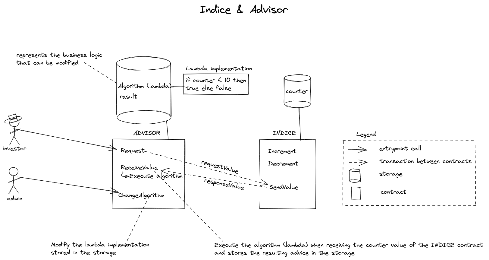

# ligo lambdas & on-chain views

This repository is meant to illustrate the communication between contracts (with on-chain views) and lambda pattern which allows to modify a contract already deployed. It deals with implementing, deploying and interacting with Tezos smart contracts.

## The Fund and its advisor (i.e. "L'indice et le conseiller")

The `indice` contract represents a fund value and the `advisor` contract gives an advice on investing on this fund. 

### Transaction workflow

Since Hangzhou protocol, on-chain views have been introduced which replace the callback pattern to retrieve a storage of another contract.

The `advisor` contract can be invoked to request the fund value from the `indice` contract (via an on-chain view). The `indice` contract receives the view request and sends back the requested value. When `advisor` contract receives the fund value it can apply the "algorithm" to check it is worth investing ! This algorithm relies on a single indice value.

The resulting advice is stored in the storage (in `result` field).

### Lambda pattern

The real business logic of the `advisor` smart contract lies in the lambda function which is defined in the storage. The storage is vowed to be modified so as for the business logic (lambda).

So an entrypoint `ChangeAlgorithm` is provided to modify the algorithm that computes the worth of investment. 

## Content

This directory illustrates the new on-chain views style and contains 2 implementations:
- cameligo: for smart contracts implementation in cameligo and `ligo` command lines for simulating all entrypoints
- jsligo: for smart contracts implementation in JSligo and `ligo` command lines for simulating all entrypoints

## Pre-requisites

You may need to install the following tools:
- node & npm
- typescript compiler - `npm install typescript --save-dev`
- docker

## Compiling / testing / deploying

This repository provides a Makefile for compiling and testing smart contracts. One can type `make` to display all available rules. 
The `make all` command will clean all produced smart contracts, then compile smart contracts and then launch tests.

The `make compile` command triggers the compilation of smart contracts (advisor and indice).

The `make test` command launches tests oon compiled smart contracts (advisor and indice).

The `make deploy` command deploys smart contracts (depending on .env file information).
